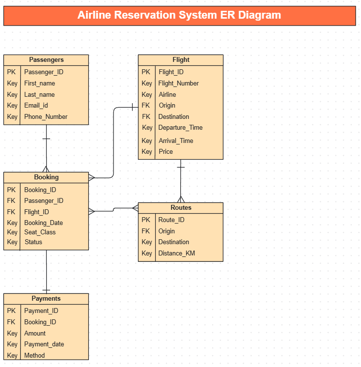

# ✈️ Airline Reservation System (SQL Project)

## 📌 Overview
This project is a relational database system designed to manage **airline reservations**.  
It contains information about flights, passengers, routes, bookings, and payments.  
The project demonstrates **SQL concepts** such as joins, aggregations, constraints, window functions, and analytical queries.  

---

## 🛠 Features
- Store **flight and passenger** information  
- Manage **bookings and payments**  
- Track **confirmed, pending, and cancelled** bookings  
- Perform **business analysis** like revenue by airline, booking rates, and frequent cancellations  

---

## 📝 Problem Statement
Airline companies need an efficient system to manage flights, passenger bookings, payments, and routes. Without a centralized database, it becomes difficult to:

 1. Track bookings and cancellations in real time

 2. Monitor revenue and analyze performance by airline or route

 3. Manage passenger information securely

 4. Identify booking patterns and improve services

To address this challenge, we have designed an Airline Reservation System Database.
This project stores flight schedules, passenger details, bookings, and payment records in a relational database.
The database also supports analytical queries to generate business insights, such as:

 1. Most profitable airlines

 2. Popular routes

 3. Frequent cancellations

 4. Average ticket prices

---

## 🗂 Database Schema
The database consists of 5 main tables:
1. **Flights** – Flight details with pricing and schedule  
2. **Passengers** – Passenger details  
3. **Routes** – Flight route and distance  
4. **Bookings** – Ticket booking information  
5. **Payments** – Payment transactions for bookings  

---

## 🖼 ER Diagram
Below is the **Entity-Relationship (ER) Diagram** for the system:  

(Relationships:  
- A **Passenger** can make multiple **Bookings**  
- A **Flight** can have many **Bookings**  
- Each **Booking** may have one **Payment**  
- Each **Flight** follows a **Route**)
